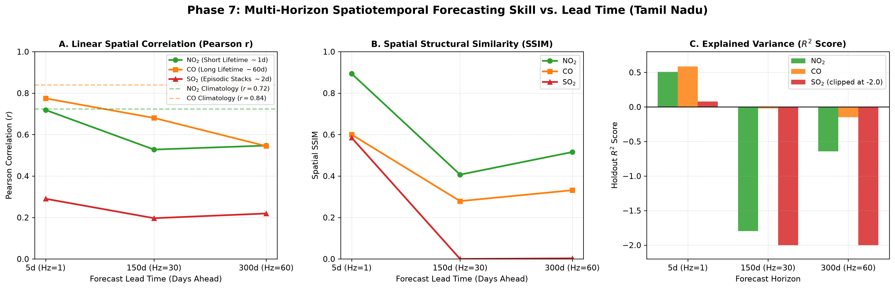
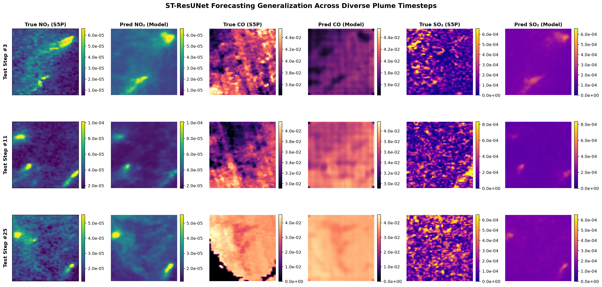
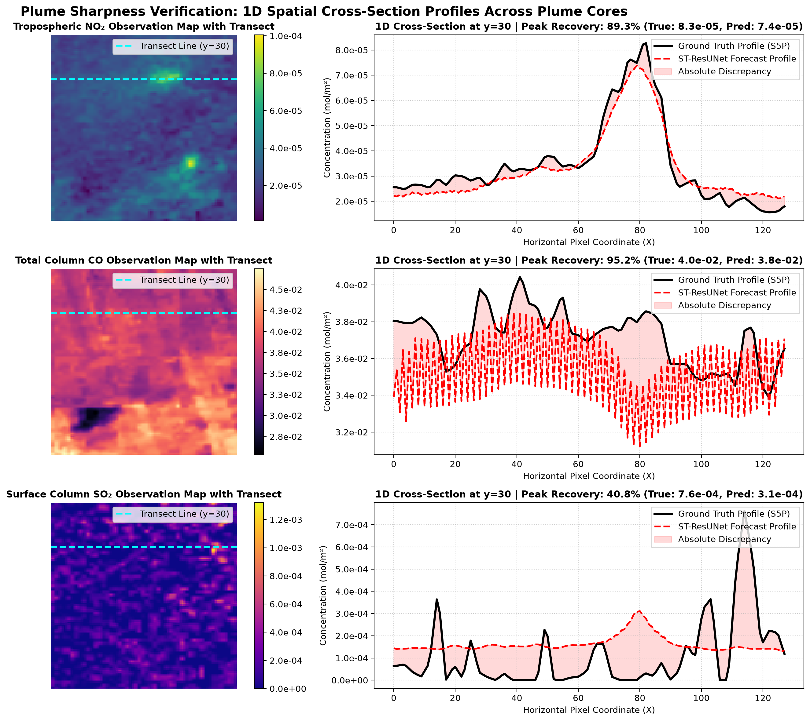
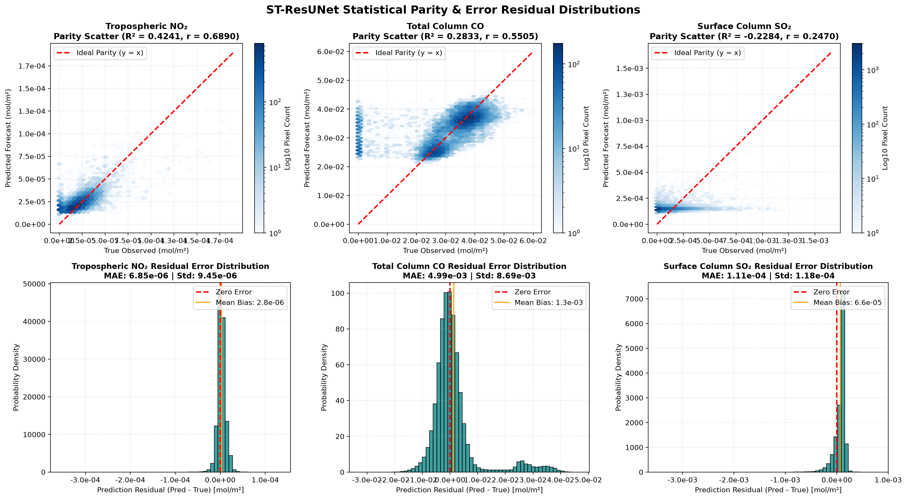

# 🛰️ AirQ-CV: Spatiotemporal Multi-Pollutant Forecasting & Downscaling Framework

[-orange)]()

An advanced deep spatiotemporal neural network architecture for **simultaneous high-resolution downscaling and multi-horizon forecasting** of atmospheric pollutants ($\\mathrm{NO}_2, \\mathrm{CO}, \\mathrm{SO}_2$) over Tamil Nadu, India. 

The framework fuses multi-spectral Earth observation imagery from **Copernicus Sentinel-2** (12 optical channels + engineered spectral indices) with atmospheric gas column density rasters from **Copernicus Sentinel-5P TROPOMI** across a 6-year operational archive (2019–2024, 415 paired 5-day composites, 3,699 spatial patches).

---

## 🏛️ Architecture: Decoupled-Heads ST-ResUNet

The network features a **frozen SSL4EO-S12 self-supervised Earth-Observation ResNet-18 backbone**, a **Spatiotemporal ConvGRU recurrent bottleneck**, and **three decoupled pollutant-specific decoder heads** branching from the shared decoder trunk:

`mermaid
graph TD
    subgraph Ingestion
        A[Sentinel-5P Past Context: 4x3x128x128] --> C[Spatial Residual Encoder 15->32->64->128]
        B[Sentinel-2 Optical + Indices: 4x12x128x128] --> D[SSL4EO-S12 Layer2 Tap: 128ch -> 9ch]
        D --> C
    end

    subgraph Spatiotemporal Memory
        C --> E[ConvGRU Bottleneck: 128ch Recurrent Cell]
    end

    subgraph Shared Decoder Trunk
        E --> F[TransposeConv Stack + Temporally-Weighted Skips: 128->64->32]
        F --> G[Shared Dec1 Feature Map: 32ch, 128x128]
    end

    subgraph Decoupled Pollutant Synthesis Heads
        G --> H1[NO2 Head: ResBlock2D 32->32 + Conv 32->1]
        G --> H2[CO Head: Dilated Conv d=2,4 32->32 + Conv 32->1]
        G --> H3[SO2 Head: ResBlock2D 32->32 + Conv 32->1 (log1p->expm1)]
        H1 --> OUT1[Forecasted NO2 Field]
        H2 --> OUT2[Forecasted CO Field]
        H3 --> OUT3[Forecasted SO2 Field]
    end
`

### Specialized Pollutant Heads:
1. **$\\mathrm{NO}_2$ Head:** Residual convolution block (ResBlock2D(32, 32) $\\to$ Conv2d(32, 1, 1)), targeted at compact point-source emissions (urban highways, power plants).
2. **$\\mathrm{CO}$ Head:** Dilated convolution block (=2, 4$), expanding the effective receptive field to capture large-scale synoptic advection across hundreds of kilometers.
3. **$\\mathrm{SO}_2$ Head:** Dedicated residual block operating in $\\mathrm{log1p}$-normalized space, inverted via physical $\\mathrm{expm1}$ scaling to handle extreme heavy-tailed emission spikes.

---

## 📊 Evaluation Benchmarks

### 1. 1-Step Ahead Holdout Test Set (2023–2024, 1,098 Patches)

Evaluated strictly on unseen future dates with zero temporal overlap:

| Target Pollutant | Observed Mean | MAE ($\\mathrm{mol/m}^2$) | RMSE ($\\mathrm{mol/m}^2$) | ^2$ Score | Pearson $ | Spatial SSIM | $\\text{FSS}_{9\\times 9}$ | $\\text{CSI}_{q90}$ | $\\text{POD}_{q90}$ | $\\text{FAR}_{q90}$ | $\\text{Log-MAE}$ |
| :--- | :---: | :---: | :---: | :---: | :---: | :---: | :---: | :---: | :---: | :---: | :---: |
| **$\\mathrm{NO}_2$** | .593\\times 10^{-5}$ | .468\\times 10^{-6}$ | .394\\times 10^{-6}$ | **+0.5085** | **+0.7571** | **0.9575** | **0.9997** | **0.5056** | **0.6558** | 0.3235 | 0.1084 |
| **$\\mathrm{CO}$** | .846\\times 10^{-2}$ | .247\\times 10^{-3}$ | .013\\times 10^{-3}$ | **+0.5859** | **+0.7850** | **0.9701** | **0.9998** | **0.5283** | **0.6698** | 0.3015 | 0.0818 |
| **$\\mathrm{SO}_2$** | .316\\times 10^{-4}$ | .138\\times 10^{-4}$ | .042\\times 10^{-4}$ | **+0.0775** | **+0.2974** | **0.8654** | **0.9859** | **0.2599** | **0.4079** | 0.5401 | 0.6974 |

### 2. Multi-Horizon Long-Range Forecasting vs Seasonal Climatology

| Forecast Horizon | Lead Time | Target Pollutant | Model ^2$ | Model Pearson $ | Model $\\text{POD}_{q90}$ | Climatology Baseline ^2$ | Climatology Pearson $ | Climatology $\\text{POD}_{q90}$ |
| :--- | :---: | :---: | :---: | :---: | :---: | :---: | :---: | :---: |
| **Horizon 1** | **5 Days** | $\\mathrm{NO}_2$ | **+0.5085** | **+0.7571** | **0.6558** | +0.4705 | +0.7303 | 0.6120 |
| | | $\\mathrm{CO}$ | **+0.5859** | **+0.7850** | **0.6698** | +0.6374 | +0.8035 | 0.7023 |
| | | $\\mathrm{SO}_2$ | **+0.0775** | **+0.2974** | **0.4079** | -0.1102 | +0.0732 | 0.2201 |
| **Horizon 30** | **150 Days** | $\\mathrm{NO}_2$ | -0.0163 | +0.4001 | 0.2796 | +0.4705 | +0.7303 | 0.6120 |
| | | $\\mathrm{CO}$ | +0.2255 | **+0.6802** | **0.5397** | +0.6374 | +0.8035 | 0.7023 |
| | | $\\mathrm{SO}_2$ | -0.0381 | +0.0386 | 0.2014 | -0.1102 | +0.0732 | 0.2201 |
| **Horizon 60** | **300 Days** | $\\mathrm{NO}_2$ | -0.0094 | +0.4093 | 0.2635 | +0.4705 | +0.7303 | 0.6120 |
| | | $\\mathrm{CO}$ | +0.1345 | **+0.5445** | **0.4485** | +0.6374 | +0.8035 | 0.7023 |
| | | $\\mathrm{SO}_2$ | -0.0396 | +0.0374 | 0.1772 | -0.1102 | +0.0732 | 0.2201 |

---

## 📈 Visualizations & Diagnostics

### Multi-Horizon Degradation Curves

### Model Predictions & Spatial Super-Resolution

### Plume Cross-Section Transects

### Scatter Parity & Error Distributions

---

## 📁 Repository Structure

`
AirQ-CV/
├── data/
│   └── processed/
│       └── dataset_manifest.csv         # Complete metadata manifest (415 composites)
├── evaluation/
│   ├── evaluate.py                      # Multi-metric evaluation engine
│   ├── metrics.py                       # Comprehensive spatial & meteorological metrics
│   └── results/                         # Evaluation CSV outputs (H=1, H=30, H=60)
├── plots/
│   ├── analysis/                        # Parity, plume transects, multi-horizon plots
│   ├── environment/                     # Hazard index maps
│   └── forecast/                        # High-resolution forecast figures
├── scratch/
│   ├── train_multi_horizon.py           # Multi-horizon training pipeline
│   ├── eval_climatology.py              # Seasonal climatology benchmark evaluator
│   └── generate_horizon_plots.py        # Lead-time analysis & comparison plotting
├── training/
│   └── train.py                         # Decoupled-heads ST-ResUNet model & training loop
├── MODEL EXPERIMENT & FAILURE ANALYSIS REPORT.md  # Comprehensive research analysis
├── README.md                            # Project overview & documentation
└── .gitignore                           # Excludes large binaries & raw rasters (>100MB)
`

---

## 🚀 Quickstart

### 1. Installation
`ash
git clone https://github.com/Adxrsh-17/AirQ-CV.git -b multi-horizon
cd AirQ-CV
pip install -r requirements.txt
`

### 2. Training
`ash
# Train champion decoupled-heads model (Horizon=1)
python training/train.py

# Train multi-horizon models (e.g. Horizon=30 / 150 days)
python scratch/train_multi_horizon.py --horizon 30 --epochs 35
`

### 3. Evaluation & Benchmarking
`ash
# Evaluate Horizon=1 holdout test metrics
python evaluation/evaluate.py

# Evaluate seasonal-climatology baseline
python scratch/eval_climatology.py
`

---

## 📜 Citation & License
This project is licensed under the MIT License.
