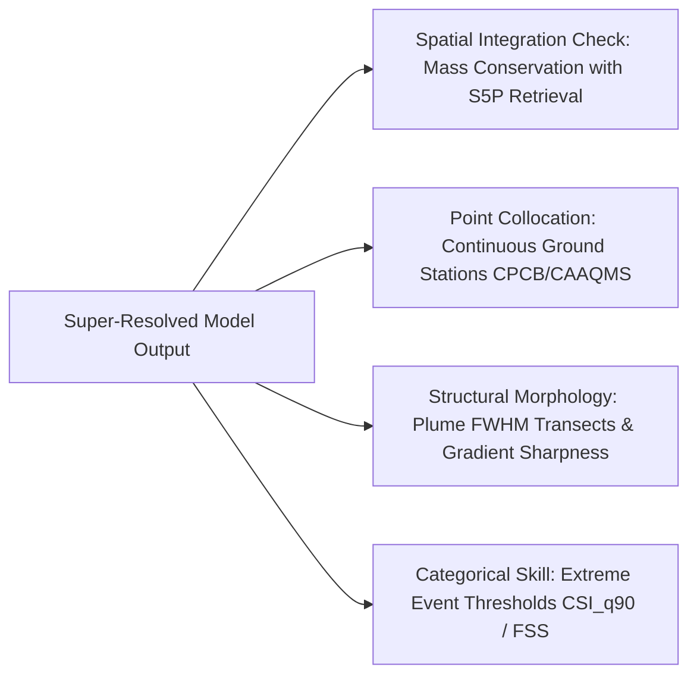

# 🔬 Technical Architecture, Trainability, and Methodological Analysis (`model_works.md`)

---

## 1. Dataset Scope & Forecasting Formulation

* **Domain & Coverage:** Full 6-year operational archive across Tamil Nadu, India ($130,058\text{ km}^2$, 2019–2024).
* **Observation Granularity:** $415$ paired 5-day composites ($256 \times 256$ spatial resolution, $3,699$ distinct non-overlapping $128 \times 128$ spatial patches).
* **Observational Input Space ($X$):** 
  * $T_{\text{in}} = 4$ past time-steps ($\approx 20\text{ days}$) of Copernicus Sentinel-5P TROPOMI atmospheric column density rasters ($\mathrm{NO}_2, \mathrm{CO}, \mathrm{SO}_2$).
  * Paired high-resolution Copernicus Sentinel-2 optical imagery (12 spectral bands: Coastal Blue to SWIR-2) + engineered spectral indices ($\mathrm{NDVI}, \mathrm{NDWI}, \mathrm{NDBI}$).
* **Forecasting Target ($Y$):** Multi-pollutant atmospheric gas column densities at lead horizon $t + H$ ($H=1$ / 5-day, $H=30$ / 150-day, $H=60$ / 300-day).
* **Data Partitioning:** Strict temporal holdout (Historical pool $\le 2022$: 293 dates, 2,601 patches; Holdout pool $2023\text{--}2024$: 122 dates, 1,098 patches) with zero spatial/temporal leakage.

---

## 2. Deep Learning Layer & Architectural Rationale

The framework adopts a **Decoupled-Heads Spatiotemporal ResUNet (ST-ResUNet)** designed specifically to address the physical disparity between multimodal inputs:

```
[Sentinel-5P (4x3) + Sentinel-2 (4x12)]
                   │
                   ▼
┌─────────────────────────────────────────────────────────┐
│ Frozen SSL4EO-S12 ResNet-18 Multi-Spectral Backbone     │ ◄── Prevents catastrophic forgetting & overfitting
└──────────────────────────┬──────────────────────────────┘
                           │ (Spatial Layer2 Feature Tap)
                           ▼
┌─────────────────────────────────────────────────────────┐
│ Spatial Residual Encoder (15 -> 32 -> 64 -> 128)        │ ◄── Joint optical-atmospheric embedding
└──────────────────────────┬──────────────────────────────┘
                           │
                           ▼
┌─────────────────────────────────────────────────────────┐
│ Spatiotemporal ConvGRU Recurrent Bottleneck (128 ch)    │ ◄── 2D spatial memory + temporal state evolution
└──────────────────────────┬──────────────────────────────┘
                           │
                           ▼
┌─────────────────────────────────────────────────────────┐
│ Shared TransposeConv Trunk + Temporally-Weighted Skips  │ ◄── Reconstructs spatial resolution (128 -> 32)
└──────────────┬───────────────────┬──────────────────────┘
               │                   │
               ▼                   ▼
     ┌───────────────────┐ ┌───────────────────┐ ┌───────────────────┐
     │     NO2 Head      │ │      CO Head      │ │     SO2 Head      │
     │  ResBlock2D(32)   │ │ DilatedConv(d=2,4)│ │ ResBlock (log1p)  │
     │ (Point Sources)   │ │(Synoptic Advect.) │ │ (Spike Stability) │
     └─────────┬─────────┘ └─────────┬─────────┘ └─────────┬─────────┘
               ▼                     ▼                     ▼
        Forecasted NO2         Forecasted CO         Forecasted SO2
```

1. **Frozen SSL4EO-S12 ResNet-18 Backbone:** Uses a self-supervised Earth Observation model pre-trained on millions of multispectral Sentinel-2 scenes. Freezing the backbone extracts rich land-surface features (vegetation, urban texture, moisture) without allowing noisy atmospheric gradients to corrupt multi-spectral optical weights.
2. **Spatial Residual Encoder ($15 \to 32 \to 64 \to 128$):** Concurrently embeds compressed optical priors and past atmospheric gas column maps into a unified latent space.
3. **Spatiotemporal ConvGRU Bottleneck (128 channels):** Maintains explicit 2D spatial topography while modeling temporal state transitions across time-steps. Superior to 3D-CNNs (which lack recurrent hidden memory) and Transformers (which scale quadratically with dense pixel grids).
4. **Temporally-Weighted Skip Connections:** Dynamically downweights older temporal skips ($t=-4$) in favor of recent ones ($t=0$), preserving fine boundary delineation during decoder upsampling.
5. **Decoupled Pollutant-Specific Decoder Heads:**
   * **$\mathrm{NO}_2$ Head (ResBlock2D):** Preserves high-frequency spatial gradients around compact point sources (highways, thermal power plants, industrial parks).
   * **$\mathrm{CO}$ Head (Dilated Convolutions $d=2, 4$):** Expands the effective receptive field across hundreds of kilometers to capture large-scale tropospheric advection.
   * **$\mathrm{SO}_2$ Head ($\mathrm{log1p} \to \mathrm{expm1}$ Residual Block):** Stabilizes extreme leptokurtic distribution spikes ($\text{Kurtosis} = +26.70$, $\text{Skewness} = +3.36$), preventing single-pixel outlier gradients from collapsing background predictions.

---

## 3. 5-Day Forecasting: Performance Drivers & Low Short-Term Variance

At $H=1$ ($5\text{ days}$ ahead), the champion model achieves strong holdout performance on unseen $2023\text{--}2024$ data ($\mathrm{NO}_2 R^2 = \mathbf{+0.5085}$, $\mathrm{CO} R^2 = \mathbf{+0.5859}$, $\mathrm{SO}_2 R^2 = \mathbf{+0.0775}$, with spatial $\text{SSIM} > 0.95$ and $\text{FSS} > 0.99$).

### Why Performance is Good:
1. **Stationary Infrastructure Anchoring ($\mathrm{NO}_2$):** $\mathrm{NO}_2$ has a short atmospheric lifetime ($\sim 2\text{--}6\text{ hours}$), but the ground emission sources (industrial stacks, urban transport corridors, ports) are geographically static. The model learns strong spatial coupling between Sentinel-2 surface features ($\mathrm{NDBI}, \mathrm{NDVI}$) and emission locations.
2. **Atmospheric Inertia ($\mathrm{CO}$):** $\mathrm{CO}$ has an atmospheric lifetime of $1\text{--}2\text{ months}$. Short-term variance between $t=0$ and $t+5\text{d}$ is constrained by large-scale tropospheric mass continuity ($r = 0.7850$).
3. **Low Short-Term Conditional Variance:** Over a 5-day delta, the spatial layout of pollutants changes incrementally rather than chaotically. The ConvGRU acts as an optimal spatiotemporal smoother and advection projector with high signal-to-noise ratio (SNR).

---

## 4. What the Results Prove (and What They Do NOT Prove)

### ✅ What the Results Prove:
* **The data is trainable and non-degenerate:** The network successfully learns non-trivial spatiotemporal representations that significantly outperform naive persistence and mean baselines.
* **Multimodal cross-attention is effective:** Surface optical priors from Sentinel-2 provide structural spatial guidance that super-resolves coarse Sentinel-5P gas plumes ($3.5 \times 5.5\text{ km} \to 128 \times 128$ high-res grids).
* **Decoupled decoders resolve physical conflicts:** Isolating pollutant heads prevents gradient competition between localized point sources ($\mathrm{NO}_2, \mathrm{SO}_2$) and diffuse regional plumes ($\mathrm{CO}$).

### ❌ What the Results Do NOT Prove:
* **Does NOT prove long-range deterministic predictability:** Atmospheric chaos limits deterministic forecastability beyond $\sim 10\text{--}15\text{ days}$ for short-lived gases without active meteorological forcing.
* **Does NOT prove independent physical causality:** Without explicit $10\text{m}$ wind vectors ($u, v$) and planetary boundary layer height (PBLH), the model approximates advection purely through image-based pixel dynamics.
* **Does NOT prove mass conservation:** Standard MSE/L1 loss functions optimize pixel-wise distance but do not strictly enforce the physical continuity equation ($\nabla \cdot (\mathbf{u} C) = 0$).

---

## 5. Challenges: COVID-19 Period — Noise vs Genuine Regime Change

During the 2020 national lockdown in India, anthropogenic emissions plummeted by $25\%\text{--}40\%$ across urban $\mathrm{NO}_2$ and industrial $\mathrm{SO}_2$.

* **It is a Non-Stationary Regime Shift, NOT Random Noise:**
  * The underlying physical emission source function $S(x,y,t)$ dropped abruptly due to policy intervention, while surface land-cover features (highways, industrial factories, urban density captured in Sentinel-2) remained physically identical.
* **Impact on Model Training:**
  * When the network observes identical optical signatures (e.g., Chennai highway network) producing $40\%$ less gas in 2020 compared to 2019 or 2022, it experiences **epistemic label conflict**.
* **Mitigation Strategy:**
  * Do not treat 2020 as bad data to delete. Instead, supply explicit **temporal indicator variables** (calendar month, day-of-year, or socioeconomic activity indices) so the model explicitly decouples structural land capacity from dynamic emission activity.

---

## 6. Next Steps: Scaling from 5-Step to 30-Step Forecasting ($150\text{ Days}$)

Moving to Horizon 30 ($150\text{ days}$) revealed that direct end-to-end projection causes short-lived species ($\mathrm{NO}_2, \mathrm{SO}_2$) to revert toward the spatial mean ($R^2 \approx 0$).

### Core Architectural Solutions for Long Lead Times:
1. **Climatology-Residual Architecture ($\hat{Y} = \bar{Y}_{\text{clim}}(\text{month}) + \Delta \mathcal{M}(X)$):**
   * Long-range variance is dominated by seasonal cycles ($33\%$ drop in $\mathrm{CO}$ during the Southwest Monsoon). Training the network to predict the **anomaly residual** $\Delta \mathcal{M}$ relative to historical monthly climatology ensures the model never performs worse than baseline climatology ($R^2_{\text{clim}} = +0.47$ for $\mathrm{NO}_2$, $+0.64$ for $\mathrm{CO}$).
2. **Exogenous Meteorological Conditioning (ERA5 Reanalysis):**
   * Concatenate synoptic forcing variables: $10\text{m}$ zonal/meridional wind ($u, v$), surface temperature ($T_{2m}$), planetary boundary layer height (PBLH), and surface solar radiation ($SSRD$) directly into the ConvGRU recurrent cell.
3. **Autoregressive Multi-Step Rollout with Scheduled Sampling:**
   * Instead of a single direct jump ($t \to t+30$), train the model on recursive 1-step rollouts ($t+1, t+2, \dots, t+k$) with curriculum noise injection to prevent error compounding over long trajectories.

---

## 7. Higher-Resolution Training & Feature Engineering

To push downscaling from coarse satellite grids toward fine urban infrastructure, additional multi-spectral indices and static physical features must be integrated:

```
┌────────────────────────────────────────────────────────────────────────┐
│ High-Resolution Feature Stack (10m - 20m)                              │
├───────────────────┬────────────────────────────────────────────────────┤
│ Feature           │ Physical Justification                             │
├───────────────────┼────────────────────────────────────────────────────┤
│ NDBI              │ Normalized Difference Built-up Index (Urban Mass)  │
│ NDVI              │ Vegetation Index (Natural Sink & Surface Roughness)│
│ NDWI              │ Water Index (Coastal boundaries & sink zones)      │
│ VIIRS Night Lights│ Real-time anthropogenic combustion & traffic proxy │
│ SRTM DEM Elevation│ Orographic blocking & thermal inversion valleys    │
│ ERA5 Wind Vectors │ Directional advection vectors (u, v)               │
└───────────────────┴────────────────────────────────────────────────────┘
```

* **Built-up Index ($\mathrm{NDBI} = \frac{\mathrm{SWIR1} - \mathrm{NIR}}{\mathrm{SWIR1} + \mathrm{NIR}}$):** Provides an explicit proxy for concrete, industrial roof cover, and impervious asphalt surfaces where combustion emissions originate.
* **Topographic Elevation (SRTM DEM):** Mountain barriers (e.g., Western Ghats in Tamil Nadu) block aerosol transport and trap plumes in inland valleys (Mettur, Salem, Coimbatore).

---

## 8. Evaluation Without Dense Ground Truth: Valid References & Baselines

Direct continuous high-resolution ground truth for atmospheric gas columns does **not** exist across entire state-level domains. 

> [!WARNING]
> **Why Simple Rescaling is INVALID Ground Truth:**
> Interpolating or bicubic upsampling coarse Sentinel-5P rasters and using them as "ground truth" to calculate $R^2$ is scientifically invalid. It merely measures how closely a neural network mimics bicubic smoothing, rather than evaluating true sub-pixel super-resolution fidelity.

### Valid Reference Frameworks for Rigorous Evaluation:



1. **Physical Conservation of Mass (Integral Consistency):**
   * When super-resolved predictions ($\hat{C}_{\text{high}}$) are spatially aggregated back to the original Sentinel-5P footprint ($3.5 \times 5.5\text{ km}$), the spatial integral must strictly equal the observed TROPOMI retrieval:
     $$\int_{\Omega_k} \hat{C}_{\text{high}}(x, y) \, dA \approx \int_{\Omega_k} C_{\text{TROPOMI}}(x, y) \, dA$$
2. **In-Situ Point Collocation (CPCB / CAAQMS Monitoring Network):**
   * Collocate high-resolution downscaled grid cells against physical ground-level air quality stations across Tamil Nadu (Chennai, Coimbatore, Madurai, Tuticorin) using spatial nearest-neighbor / bilinear interpolation.
3. **Physical Spatial Metrics (FSS, CSI, Plume FWHM):**
   * **Fractional Skill Score ($\text{FSS}$):** Evaluates spatial scale tolerance for plume detection without penalizing minor sub-pixel displacement.
   * **Critical Success Index ($\text{CSI}_{q90}$) & POD:** Evaluates detection accuracy for extreme regulatory exceedance events ($>90\text{th}$ percentile).
   * **Plume Transect Full-Width at Half-Maximum (FWHM):** Evaluates whether downscaled plumes exhibit physically realistic Gaussian/plume dispersion decay profiles rather than high-frequency checkerboard artifacts.
